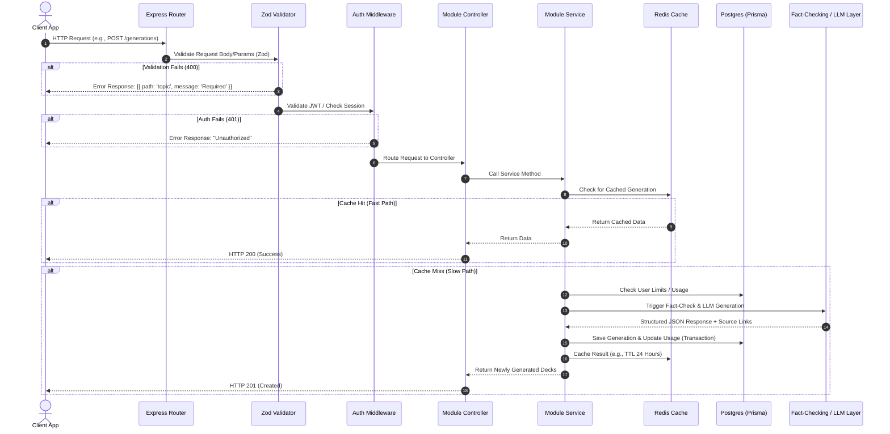
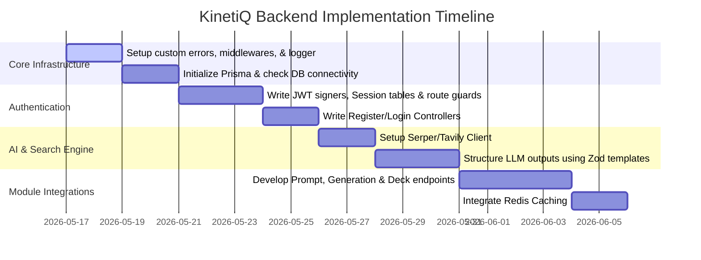

# KinetiQ: Production-Grade Backend Architecture & Implementation Plan

Welcome to the KinetiQ Backend Architecture & Implementation Plan. This document provides a concrete, step-by-step roadmap to build a highly scalable, secure, and performant Node.js backend using **TypeScript**, **Express**, and **Prisma (PostgreSQL)**. 

To separate KinetiQ from a typical "AI Wrapper" and make it a showcase of premium software engineering, this backend is structured as a **Modular Monolith**. It implements robust security, strict runtime data validation, global error management, caching, and a multi-layered intelligence engine that cross-references AI outputs with live web data.

---

## 🏗️ 1. Architecture Overview & Request Lifecycle

A modular monolith divides the application into isolated, domain-specific modules (e.g., `auth`, `user`, `prompt`, `generation`, `analytics`). Each module contains its own routes, controller, service, schemas, and optional data-access layers, communicating with other modules via clean TypeScript interfaces.

### 🔄 The Request Lifecycle


---

## 🛠️ Phase 1: Core Foundations & Infrastructure

Before writing any business logic, we must establish a bulletproof base. This prevents the code from becoming cluttered with repetitive `try-catch` blocks and manual type checks.

### 📁 Step 1: Install Key Dependencies
Run this in the `/server` directory to install validation, hashing, CORS, and logging libraries:
```bash
npm install zod bcrypt jsonwebtoken express-rate-limit cors helmet winston morgan
npm install --save-dev @types/bcrypt @types/jsonwebtoken @types/cors
```

### 🧱 Step 2: Custom Error Framework
Create a global error-handling structure so your controllers don't need manual try-catch wrappers.

Create [server/src/utils/errors.ts](file:///home/joelanto/Projects/kinetiq/server/src/utils/errors.ts):
```typescript
export class HttpException extends Error {
  constructor(public statusCode: number, message: string, public details?: any) {
    super(message);
    Object.setPrototypeOf(this, new.target.prototype);
  }
}

export class BadRequestException extends HttpException {
  constructor(message = "Bad Request", details?: any) {
    super(400, message, details);
  }
}

export class UnauthorizedException extends HttpException {
  constructor(message = "Unauthorized") {
    super(401, message);
  }
}

export class ForbiddenException extends HttpException {
  constructor(message = "Forbidden") {
    super(403, message);
  }
}

export class NotFoundException extends HttpException {
  constructor(message = "Resource Not Found") {
    super(404, message);
  }
}

export class ConflictException extends HttpException {
  constructor(message = "Conflict", details?: any) {
    super(409, message, details);
  }
}

export class InternalServerErrorException extends HttpException {
  constructor(message = "Internal Server Error") {
    super(500, message);
  }
}
```

Create [server/src/utils/asyncHandler.ts](file:///home/joelanto/Projects/kinetiq/server/src/utils/asyncHandler.ts):
```typescript
import { Request, Response, NextFunction } from "express";

/**
 * Wraps async Express handlers to automatically forward thrown errors to the global error middleware.
 */
export const asyncHandler = (fn: Function) => {
  return (req: Request, res: Response, next: NextFunction) => {
    Promise.resolve(fn(req, res, next)).catch(next);
  };
};
```

Create [server/src/middleware/errorHandler.ts](file:///home/joelanto/Projects/kinetiq/server/src/middleware/errorHandler.ts):
```typescript
import { Request, Response, NextFunction } from "express";
import { HttpException } from "../utils/errors";

export const errorHandler = (
  err: Error,
  req: Request,
  res: Response,
  next: NextFunction
): void => {
  const statusCode = err instanceof HttpException ? err.statusCode : 500;
  const message = err.message || "Internal Server Error";
  const details = err instanceof HttpException ? err.details : undefined;

  // Real production backend: Log detailed errors internally, but don't expose stack traces to client
  console.error(`[Error] ${req.method} ${req.url} - Status: ${statusCode} - Msg: ${message}`);
  if (statusCode === 500) {
    console.error(err.stack);
  }

  res.status(statusCode).json({
    status: "error",
    statusCode,
    message: statusCode === 500 && process.env.NODE_ENV === "production" ? "Internal Server Error" : message,
    ...(details && { errors: details }),
    ...(process.env.NODE_ENV !== "production" && { stack: err.stack }),
  });
};
```

### 🛡️ Step 3: Zod Schema Validation Middleware
This middleware validates incoming requests against Zod schemas (for `body`, `query`, or `params`) and returns structured JSON errors before hitting route controllers.

Create [server/src/middleware/validate.ts](file:///home/joelanto/Projects/kinetiq/server/src/middleware/validate.ts):
```typescript
import { Request, Response, NextFunction } from "express";
import { AnyZodObject, ZodError } from "zod";
import { BadRequestException } from "../utils/errors";

export const validateRequest = (schema: AnyZodObject) => {
  return async (req: Request, res: Response, next: NextFunction): Promise<void> => {
    try {
      const parsed = await schema.parseAsync({
        body: req.body,
        query: req.query,
        params: req.params,
      });
      // Replace req with validated and typed data
      req.body = parsed.body;
      req.query = parsed.query;
      req.params = parsed.params;
      next();
    } catch (error) {
      if (error instanceof ZodError) {
        const formattedErrors = error.errors.map((err) => ({
          field: err.path.slice(1).join("."), // removes 'body', 'query', or 'params' prefix
          message: err.message,
        }));
        next(new BadRequestException("Validation failed", formattedErrors));
      } else {
        next(error);
      }
    }
  };
};
```

---

## 🔐 Phase 2: Production-Grade Authentication & Sessions

Instead of standard JWTs that expire in 7 days (unsafe) or basic cookies, real production web apps utilize **short-lived access tokens (JWTs)** combined with **database-backed refresh tokens** with automatic rotation.

### 📝 Step 1: JWT & Session Mechanics
1. **Access Token (Short-lived)**: Valid for `15m`. Transmitted via `Authorization: Bearer <token>` header or Secure HTTP-only Cookie.
2. **Refresh Token (Long-lived)**: Valid for `7d`. Stored in the `Session` table in PostgreSQL. When a user requests a new Access Token:
   - Verify the refresh token signature.
   - Look up the `refreshToken` in the database.
   - If found and not expired: Generate a brand-new access token + rotate the refresh token (delete the old session, create a new session, and issue it).
   - If a refresh token is reused, it triggers "token reuse detection"—meaning we delete all sessions for that user, forcing them to re-log in (protects against theft).

Create Auth Middleware [server/src/middleware/auth.ts](file:///home/joelanto/Projects/kinetiq/server/src/middleware/auth.ts):
```typescript
import { Request, Response, NextFunction } from "express";
import jwt from "jsonwebtoken";
import { UnauthorizedException } from "../utils/errors";
import prisma from "../prisma.config"; // Ensure client is imported correctly

export interface AuthRequest extends Request {
  user?: {
    id: string;
    email: string;
    role: string;
  };
}

export const requireAuth = (req: AuthRequest, res: Response, next: NextFunction) => {
  const authHeader = req.headers.authorization;
  if (!authHeader || !authHeader.startsWith("Bearer ")) {
    throw new UnauthorizedException("Authentication token is missing or invalid");
  }

  const token = authHeader.split(" ")[1];
  try {
    const payload = jwt.verify(token, process.env.JWT_ACCESS_SECRET || "access_secret") as {
      sub: string;
      email: string;
      role: string;
    };

    req.user = {
      id: payload.sub,
      email: payload.email,
      role: payload.role,
    };
    next();
  } catch (error) {
    throw new UnauthorizedException("Token expired or corrupted");
  }
};
```

---

## 🧱 Phase 3: The Modular Business Architecture (User & Auth Module)

Let's look at how a modular structure keeps directories clean. For each module (e.g. `user`), we organize files directly by context. Let's see the skeleton of the **Auth & User Modules**.

```
server/src/modules/
├── auth/
│   ├── auth.controller.ts     # Handles login, register, refresh tokens, logout routes
│   ├── auth.routes.ts         # Routes binding to validator & controller
│   ├── auth.schema.ts         # Zod schemas for input validation
│   └── auth.service.ts        # Performs password comparisons, signs JWTs, creates sessions
└── user/
    ├── user.controller.ts     # Handles profile views, configurations
    ├── user.routes.ts         # User routes
    ├── user.schema.ts         # User Zod validations
    └── user.service.ts        # Fetches/mutates users via Prisma
```

### 🧬 Sample implementation for the Auth Module
Let's see exactly how this ties together by looking at the schema validation and controller implementation:

Create [server/src/modules/auth/auth.schema.ts](file:///home/joelanto/Projects/kinetiq/server/src/modules/auth/auth.schema.ts):
```typescript
import { z } from "zod";

export const registerSchema = z.object({
  body: z.object({
    email: z.string().email("Invalid email address"),
    username: z.string().min(3, "Username must be at least 3 characters").max(30),
    password: z.string().min(8, "Password must be at least 8 characters long"),
  }),
});

export const loginSchema = z.object({
  body: z.object({
    email: z.string().email("Invalid email address"),
    password: z.string().min(1, "Password is required"),
  }),
});
```

Create [server/src/modules/auth/auth.routes.ts](file:///home/joelanto/Projects/kinetiq/server/src/modules/auth/auth.routes.ts):
```typescript
import { Router } from "express";
import { AuthController } from "./auth.controller";
import { validateRequest } from "../../middleware/validate";
import { registerSchema, loginSchema } from "./auth.schema";

const router = Router();
const controller = new AuthController();

router.post("/register", validateRequest(registerSchema), controller.register);
router.post("/login", validateRequest(loginSchema), controller.login);
router.post("/refresh", controller.refresh);
router.post("/logout", controller.logout);

export default router;
```

---

## 🤖 Phase 4: Setting Up the AI & Fact Verification Engine (Anti-Wrapper Design)

A primary flaw of basic AI apps is their tendency to hallucinate and return stale information (e.g., details about a player transfer that occurred yesterday). KinetiQ separates itself from cheap wrappers using a **Fact-Credibility Orchestrator** which ground LLM results in real-time.

```
                  ┌──────────────────────┐
                  │ User Prompt (Topic)  │
                  └──────────┬───────────┘
                             │
                             ▼
               ┌───────────────────────────┐
               │ Smart Prompt Expansion    │
               │ (LLM categories/concepts) │
               └─────────────┬─────────────┘
                             │
                             ▼
              ┌─────────────────────────────┐
              │  Real-Time Web Scraper/API  │
              │  (Tavily / Google Search)   │
              └─────────────┬─────────────┘
                             │
                             ▼
              ┌─────────────────────────────┐
              │ Credibility Aggregator      │
              │ (Cross-reference data)      │
              └─────────────┬─────────────┘
                             │
                             ▼
             ┌───────────────────────────────┐
             │ Structured LLM Output Engine  │
             │ (Generates cards & citations) │
             └──────────────┬────────────────┘
                            │
                            ▼
               ┌──────────────────────────┐
               │ Return Swipeable Cards:  │
               │ - Short facts            │
               │ - Trust Score (🟢/🟡)    │
               │ - Direct Reference links │
               └──────────────────────────┘
```

### 🧠 Step 1: Smart Prompt Expansion & Structuring (Zod + LLM)
Instead of feeding raw prompts to the LLM, expand the search query behind the scenes.
- If a user types *"Premier League"*, expand it to fetch: *"Premier League standings May 2026"*, *"Latest Premier League transfers"*, *"Recent Premier League injuries"*.
- Force the LLM to output a strictly formatted JSON structure using **Structured Outputs** (e.g., Zod schemas mapped to Gemini's response schema).

### 🔍 Step 2: The Fact Credibility Layer
Before generating facts, call a search utility (such as Tavily API, Serper API, or Google Custom Search API):
1. **Search**: Search the web for context on the expanded prompt.
2. **Context Injection**: Compile the search snippets (along with URLs) and inject them into the LLM context.
3. **Citation Generation**: Have the LLM cite specific links. If a fact has direct grounding in the search results, flag it as `🟢 VERIFIED_SOURCE` and supply the URL. If it relies on model pretraining, flag it as `🟡 AI_INFERRED`.

Here is an architectural template for [server/src/modules/generation/generation.service.ts](file:///home/joelanto/Projects/kinetiq/server/src/modules/generation/generation.service.ts):

```typescript
import prisma from "../../prisma.config";
import { BadRequestException } from "../../utils/errors";

export interface Card {
  id: string;
  type: "STAT" | "COMPARISON" | "TIMELINE" | "QUIZ" | "FACT";
  title: string;
  fact: string;
  credibility: "VERIFIED_SOURCE" | "AI_INFERRED";
  sourceUrl?: string;
  metadata?: any;
}

export class GenerationService {
  /**
   * Generates a deck of cards grounded in live information
   */
  async generateDeck(userId: string, promptContent: string, options: { freshness: "LATEST" | "HISTORICAL" | "MIXED" }) {
    // 1. Check & increment user limits (avoid database abuse)
    const usage = await prisma.usage.findUnique({ where: { userId } });
    if (usage && usage.totalPrompts >= 50) { // Limit free decks
      throw new BadRequestException("Monthly prompt generation limit reached");
    }

    // 2. Fetch live data if freshness is "LATEST" or "MIXED"
    let webContext = "";
    let citations: string[] = [];
    if (options.freshness !== "HISTORICAL") {
      const searchResults = await this.fetchLiveSearchContext(promptContent);
      webContext = searchResults.context;
      citations = searchResults.urls;
    }

    // 3. Coordinate LLM Generation using Gemini/OpenAI with Structured Output
    const generatedCards = await this.requestStructuredLLMOutput(promptContent, webContext, options.freshness);

    // 4. Save to Database using a single atomic transaction
    const savedGeneration = await prisma.$transaction(async (tx) => {
      // Create Prompt record
      const prompt = await tx.prompt.create({
        data: {
          userId,
          content: promptContent,
          title: promptContent.substring(0, 30),
        }
      });

      // Create Generation record storing structured JSON
      const generation = await tx.generation.create({
        data: {
          promptId: prompt.id,
          userId,
          modelUsed: "gemini-2.5-pro",
          response: generatedCards as any, // Stored as JSON
          tokensUsed: 1200, 
        }
      });

      // Update Usage statistics
      await tx.usage.upsert({
        where: { userId },
        create: { userId, totalPrompts: 1, totalTokens: 1200 },
        update: {
          totalPrompts: { increment: 1 },
          totalTokens: { increment: 1200 },
          lastActiveAt: new Date()
        }
      });

      return generation;
    });

    return savedGeneration;
  }

  private async fetchLiveSearchContext(query: string) {
    // Make call to Serper, Tavily, or search API
    // Return structured text context + reliable domain URLs for citations
    return {
      context: "Search context here detailing recent real-world events",
      urls: ["https://wikipedia.org/...", "https://bbc.com/news/..."]
    };
  }

  private async requestStructuredLLMOutput(prompt: string, context: string, freshness: string): Promise<Card[]> {
    // Configure API key, set Zod Schema for JSON output, call LLM
    // Example cards format:
    return [
      {
        id: "1",
        type: "STAT",
        title: "Record Breaker",
        fact: "Lionel Messi scored 91 goals in a single calendar year (2012).",
        credibility: "VERIFIED_SOURCE",
        sourceUrl: "https://www.guinnessworldrecords.com/messi-91-goals"
      }
    ];
  }
}
```

---

## ⚡ Phase 5: High-Performance Caching (Redis)

Because LLM generation takes **1.5s to 4s** and incurs API token costs, caching is critical.
If two users request decks on *"Artificial Intelligence"* or *"F1 2026"* within the same hour, they shouldn't trigger two LLM generations. Instead, pull from a Redis cache in **< 50ms**.

### ⚙️ Redis Cache Logic:
1. **Cache Key Structure**: `kinetiq:cache:deck:<hash-of-prompt>:<freshness>`
2. **TTL (Time to Live)**: 
   - `LATEST`: `4 Hours` (since news changes daily)
   - `HISTORICAL`: `30 Days` (rarely changes)
   - `MIXED`: `12 Hours`

---

## 🚀 Execution Checklist: How to Start Coding

Here is the exact order to write and test your backend code to build a secure, highly cohesive app.



### 🗺️ Step-by-Step Execution Plan

1. **Step 1: Core setup**
   - Create custom HTTP exception utilities, the `asyncHandler` wrapper, Zod validation middleware, and global error handlers inside your folders. Let's register `errorHandler` inside [server/src/index.ts](file:///home/joelanto/Projects/kinetiq/server/src/index.ts).
2. **Step 2: Database Initialization**
   - Configure your `.env` connection string.
   - Run `npx prisma db push` or `npx prisma migrate dev` to synchronize your PostgreSQL schema.
   - Verify connectivity.
3. **Step 3: User & Authentication Operations**
   - Create the User and Auth modules (schemas, controllers, routes, and services).
   - Write `/auth/register` and `/auth/login` to securely hash and register users, generating valid JWTs.
   - Build a route protector middleware (`requireAuth`) and test it on a `/user/profile` endpoint.
4. **Step 4: AI & Search grounding integrations**
   - Create client wrappers for Gemini/OpenAI.
   - Setup external API searches (e.g., Tavily or Serper) to extract trustworthy text.
   - Build prompt builders that inject the scrape/search results into the system context.
5. **Step 5: Card & Deck Generations**
   - Create the Generation module to execute smart expansion, run the grounding engine, save the structured JSON into PostgreSQL, and update usage balances.
   - Set up API routes for `/generations` to support the front-end deck builder.

---

> [!TIP]
> **Pro-Tip for Live Grounding**: Set up free accounts on [Tavily AI](https://tavily.com/) or [Serper.dev](https://serper.dev/) for search APIs. They have excellent free tiers and will return structured snippets and citation URLs in neat JSON format, reducing the need for raw scraping!

> [!IMPORTANT]
> Keep your Prisma schema aligned. Notice that the `output` in generator `client` is set to `../src/generated/prisma`. Ensure that you build the Prisma client (`npx prisma generate`) before running the server so the typescript imports resolve correctly.
